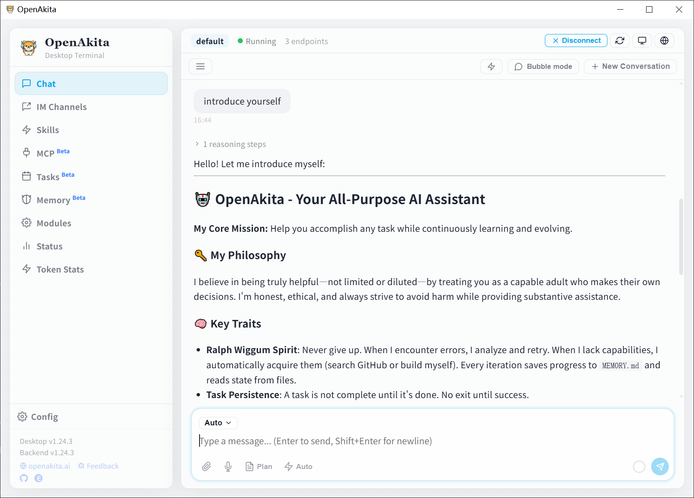

<p align="center">
  
</p>

<h1 align="center">OpenAkita</h1>

<p align="center">
  <strong>Self-Evolving AI Agent — Learns Autonomously, Never Gives Up</strong>
</p>

<p align="center">
  
  
  
  
  
</p>

<p align="center">
  <a href="#desktop-terminal">Desktop Terminal</a> •
  <a href="#features">Features</a> •
  <a href="#quick-start">Quick Start</a> •
  <a href="#architecture">Architecture</a> •
  <a href="#documentation">Documentation</a>
</p>

<p align="center">
  <strong>English</strong> | <a href="README_CN.md">中文</a>
</p>

---

## What is OpenAkita?

**An AI Agent that keeps getting smarter while you sleep.**

Most AI assistants forget you the moment the chat ends. OpenAkita teaches itself new skills, fixes its own bugs, and remembers everything you've told it — like the Akita dog it's named after: **loyal, reliable, never quits**.

Set up in 3 minutes with just an API key. 8 personas, 6 IM platforms, and yes — it sends memes.

---

## Desktop Terminal

<p align="center">
  
</p>

OpenAkita provides a cross-platform **Desktop Terminal** (built with Tauri + React) — an all-in-one AI assistant with chat, configuration, monitoring, and skill management:

- **AI Chat Assistant** — Streaming output, Markdown rendering, multimodal input, Thinking display, Plan mode
- **Bilingual (CN/EN)** — Auto-detects system language, one-click switch, fully internationalized
- **Localization & i18n** — First-class support for Chinese and international ecosystems, PyPI mirrors, IM channels
- **LLM Endpoint Manager** — Multi-provider, multi-endpoint, auto-failover, online model list fetching
- **IM Channel Setup** — Telegram, Feishu, WeCom, DingTalk, QQ Official Bot, OneBot — all in one place
- **Persona & Living Presence** — 8 role presets, proactive greetings, memory recall, learns your preferences
- **Skill Marketplace** — Browse, download, configure skills in one place
- **Status Monitor** — Compact dashboard: service/LLM/IM health at a glance
- **System Tray** — Background residency + auto-start on boot, one-click start/stop

> **Download**: [GitHub Releases](https://github.com/openakita/openakita/releases)
>
> Available for Windows (.exe) / macOS (.dmg) / Linux (.deb / .AppImage)

### 3-Minute Quick Setup — Zero to Chatting

No command line. No config files. **From install to conversation in 3 minutes**:

<p align="center">
  
</p>

<table>
<tr>
<td width="50%">

**Quick Setup (Recommended for new users)**

```
① Fill in  → Add LLM endpoint + IM (optional)
② One-click → Auto-create env, install deps, write config
③ Done      → Launch service, start chatting
```

Just one API Key, everything else is automatic:
- Auto-create workspace
- Auto-download & install Python 3.11
- Auto-create venv + pip install
- Auto-write 40+ recommended defaults
- Auto-save IM channel settings

</td>
<td width="50%">

**Full Setup (Power users)**

```
Workspace → Python → Install → LLM Endpoints
→ IM Channels → Tools & Skills → Agent System → Finish
```

8-step guided wizard with full control:
- Custom workspaces (multi-env isolation)
- Choose Python version & install source
- Configure desktop automation, MCP tools
- Tune persona, living presence parameters
- Logging, memory, scheduler & more

</td>
</tr>
</table>

> Switch between modes anytime — click "Switch Setup Mode" in the sidebar to return to the selection page without losing existing configuration.
>
> See [Configuration Guide](docs/configuration-guide.md) for full details.

---

## Features

| | Feature | In One Line |
|:---:|---------|-------------|
| **1** | **Self-Learning & Evolution** | Daily self-check, memory consolidation, task retrospection, auto skill generation — it gets smarter while you sleep |
| **2** | **8 Personas + Living Presence** | Girlfriend / Butler / Jarvis… not just role-play — proactive greetings, remembers your birthday, auto-mutes at night |
| **3** | **3-Min Quick Setup** | Desktop app, one-click start — just drop in an API Key, Python/env/deps/config all automatic |
| **4** | **Plan Mode** | Complex tasks auto-decomposed into multi-step plans, real-time tracking, Plan → Act → Verify loop until done |
| **5** | **Dynamic Multi-LLM** | 9+ providers hot-swappable, priority routing + auto-failover, one goes down, next picks up seamlessly |
| **6** | **Skill + MCP Standards** | Agent Skills / MCP open standards, one-click GitHub skill install, plug-and-play ecosystem |
| **7** | **7 IM Platforms** | Telegram / Feishu / WeCom / DingTalk / QQ Official Bot / OneBot / CLI — wherever you are, it's there |
| **8** | **AI That Sends Memes** | Probably the first AI Agent that "meme-battles" — 5700+ stickers, mood-aware, persona-matched (powered by [ChineseBQB](https://github.com/zhaoolee/ChineseBQB)) |

---

## How Does It Keep Getting Smarter?

Other AIs forget you the moment you close the chat. OpenAkita **self-evolves** — while you sleep, it's learning:

```
Every day 03:00  →  Memory consolidation: semantic dedup, extract insights, refresh MEMORY.md
Every day 04:00  →  Self-check: analyze error logs → LLM diagnosis → auto-fix → report
After each task   →  Retrospection: analyze efficiency, extract lessons, store long-term
When stuck        →  Auto-generate skills + install dependencies — it won't be stuck next time
Every chat turn   →  Mine your preferences and habits — gets to know you over time
```

> Example: You ask it to write Python, it finds a missing package — auto `pip install`. Needs a new tool — auto-generates a Skill. Next morning, it's already fixed yesterday's bugs.

---

## Recommended Models

| Model | Provider | Notes |
|-------|----------|-------|
| `claude-sonnet-4-5-*` | Anthropic | Default, balanced |
| `claude-opus-4-5-*` | Anthropic | Most capable |
| `qwen3-max` | Alibaba | Strong Chinese support |
| `deepseek-v3` | DeepSeek | Cost-effective |
| `kimi-k2.5` | Moonshot | Long-context |
| `minimax-m2.1` | MiniMax | Great for dialogue |

> For complex reasoning, enable Thinking mode — just add `-thinking` suffix to the model name (e.g., `claude-opus-4-5-20251101-thinking`).

---

## Quick Start

### Option 1: Desktop App (Recommended)

The easiest way — download, drop in an API Key, click, done:

1. Download from [GitHub Releases](https://github.com/openakita/openakita/releases) (Windows / macOS / Linux)
2. Install and launch OpenAkita Desktop
3. Choose **Quick Setup** → Add LLM endpoint → Click "Start Setup" → All automatic → Start chatting

> Need full control? Choose **Full Setup**: Workspace → Python → Install → LLM → IM → Tools → Agent → Finish

### Option 2: pip Install

```bash
pip install openakita[all]    # Install (with all optional features)
openakita init                # Run setup wizard
openakita                     # Launch interactive CLI
```

### Option 3: Source Install

```bash
git clone https://github.com/openakita/openakita.git
cd openakita
python -m venv venv && source venv/bin/activate
pip install -e ".[all]"
openakita init
```

### Commands

```bash
openakita                              # Interactive chat
openakita run "Build a calculator"     # Execute a single task
openakita serve                        # Service mode (IM channels)
openakita daemon start                 # Background daemon
openakita status                       # Check status
```

### Minimum Config

```bash
# .env (just two lines to get started)
ANTHROPIC_API_KEY=your-api-key     # Or DASHSCOPE_API_KEY, etc.
TELEGRAM_BOT_TOKEN=your-bot-token  # Optional — connect Telegram
```

---

## Architecture

```
Desktop App (Tauri + React)
    │
Identity ─── SOUL.md · AGENT.md · USER.md · MEMORY.md · 8 Persona Presets
    │
Core     ─── Brain(LLM) · Memory(Vector) · Ralph(Never-Give-Up Loop)
    │        Prompt Compiler · PersonaManager · ProactiveEngine
    │
Tools    ─── Shell · File · Web · Browser · Desktop · MCP · Skills
    │        Scheduler · Plan · Sticker · Persona
    │
Evolution ── SelfCheck · Generator · Installer · LogAnalyzer
    │        DailyConsolidator
    │
Channels ─── CLI · Telegram · Feishu · WeCom · DingTalk · QQ Official · OneBot
```

> See [Architecture Doc](docs/architecture.md) for full details.

---

## Documentation

| Document | Content |
|----------|---------|
| [Configuration Guide](docs/configuration-guide.md) | Desktop Quick Setup & Full Setup walkthrough |
| ⭐ [LLM Provider Setup](docs/llm-provider-setup-tutorial.md) | **API Key registration + endpoint config + multi-endpoint Failover** |
| ⭐ [IM Channel Setup](docs/im-channel-setup-tutorial.md) | **Telegram / Feishu / DingTalk / WeCom / QQ Official Bot / OneBot step-by-step tutorial** |
| [Quick Start](docs/getting-started.md) | Installation and basics |
| [Architecture](docs/architecture.md) | System design and components |
| [Configuration](docs/configuration.md) | All config options |
| [Deployment](docs/deploy.md) | Production deployment (systemd / Docker) |
| [IM Channels Reference](docs/im-channels.md) | IM channels technical reference (media matrix / architecture) |
| [MCP Integration](docs/mcp-integration.md) | Connecting external services |
| [Skill System](docs/skills.md) | Creating and using skills |

---

## Community

<table>
  <tr>
    <td align="center">
      <br/>
      <b>WeChat (Personal)</b><br/>
      <sub>Scan to add, note "OpenAkita" to join group</sub>
    </td>
    <td align="center">
      <br/>
      <b>WeChat Group</b><br/>
      <sub>Scan to join directly (⚠️ refreshed weekly)</sub>
    </td>
    <td>
      <b>WeChat</b> — Scan to add friend (never expires), note "OpenAkita" to get invited<br/><br/>
      <b>WeChat Group</b> — Scan to join directly (QR refreshed weekly)<br/><br/>
      <b>Discord</b> — <a href="https://discord.gg/vFwxNVNH">Join Discord</a><br/><br/>
      <b>X (Twitter)</b> — <a href="https://x.com/openakita">@openakita</a><br/><br/>
      <b>Email</b> — <a href="mailto:zacon365@gmail.com">zacon365@gmail.com</a>
    </td>
  </tr>
</table>

[Issues](https://github.com/openakita/openakita/issues) · [Discussions](https://github.com/openakita/openakita/discussions) · [Star](https://github.com/openakita/openakita)

---

## Acknowledgments

- [Anthropic Claude](https://www.anthropic.com/claude) — Core LLM engine
- [Tauri](https://tauri.app/) — Cross-platform desktop framework
- [ChineseBQB](https://github.com/zhaoolee/ChineseBQB) — 5700+ stickers that give AI a soul
- [browser-use](https://github.com/browser-use/browser-use) — AI browser automation
- [AGENTS.md](https://agentsmd.io/) / [Agent Skills](https://agentskills.io/) — Open standards
- [ZeroMQ](https://zeromq.org/) — Multi-agent IPC

## License

Apache License 2.0 — See [LICENSE](LICENSE)

Third-party licenses: [THIRD_PARTY_NOTICES.md](THIRD_PARTY_NOTICES.md)

## Star History

<a href="https://star-history.com/#openakita/openakita&Date">
 <picture>
   <source media="(prefers-color-scheme: dark)" srcset="https://api.star-history.com/svg?repos=openakita/openakita&type=Date&theme=dark" />
   <source media="(prefers-color-scheme: light)" srcset="https://api.star-history.com/svg?repos=openakita/openakita&type=Date" />
   
 </picture>
</a>

---

<p align="center">
  <strong>OpenAkita — Self-Evolving AI Agent That Sends Memes, Learns Autonomously, Never Gives Up</strong>
</p>
