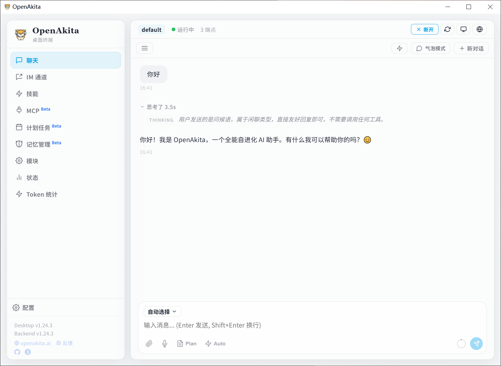
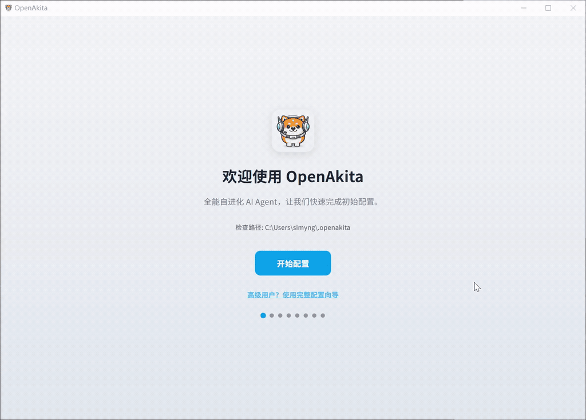

<p align="center">
  
</p>

<h1 align="center">OpenAkita</h1>

<p align="center">
  <strong>自进化 AI Agent — 自主学习，永不放弃</strong>
</p>

<p align="center">
  
  
  
  
  
</p>

<p align="center">
  <a href="#桌面终端ai-助手--一站式管理">桌面终端</a> •
  <a href="#核心特性">核心特性</a> •
  <a href="#快速开始">快速开始</a> •
  <a href="#架构">架构</a> •
  <a href="#文档">文档</a>
</p>

<p align="center">
  <a href="README.md">English</a> | <strong>中文</strong>
</p>

---

## 什么是 OpenAkita？

**一个你睡觉时还在变强的 AI Agent。**

别的 AI 助手用完即走，OpenAkita 会自己学技能、自己修 bug、记住你说过的每句话——像秋田犬一样，**忠诚、可靠、永不言弃**。

3 分钟装好，填个 API Key 就能用。支持 8 种人格、6 大 IM 平台，还会发表情包。

---

## 桌面终端：AI 助手 + 一站式管理

<p align="center">
  
</p>

OpenAkita 提供跨平台的 **桌面终端** 应用（基于 Tauri + React），集 AI 聊天、配置管理、状态监控于一体：

- **AI 聊天助手** — 流式对话、Markdown 渲染、多模态输入、Thinking 展示、Plan 模式
- **中英文双语** — 自动识别系统语言，一键切换，全面国际化
- **中国本土化** — 国内 LLM 服务商一等支持、PyPI 镜像源、中文 IM 通道
- **LLM 端点管理** — 多服务商、多端点、主备自动切换、在线拉取模型列表
- **IM 通道配置** — Telegram、飞书、企业微信、钉钉、QQ 官方机器人、OneBot 一站式配置
- **角色 & 活人感** — 8 种预设角色，主动问候、记忆回忆，越用越懂你
- **技能市场** — 浏览、下载、配置技能，一站式管理
- **状态监控** — 紧凑面板：服务/LLM/IM 健康状态一屏展示
- **后台常驻** — 系统托盘 + 开机自启动，一键启动/停止

> **下载安装包**：[GitHub Releases](https://github.com/openakita/openakita/releases)
>
> 支持 Windows (.exe) / macOS (.dmg) / Linux (.deb / .AppImage)

### 3 分钟快速配置 — 开箱即用

不需要命令行，不需要改配置文件。**3 分钟从安装到对话**：

<p align="center">
  
</p>

<table>
<tr>
<td width="50%">

**快速配置（推荐新手）**

```
① 填写 → 添加 LLM 端点 + IM（可选）
② 一键 → 自动创建环境、安装依赖、写入配置
③ 完成 → 启动服务，开始对话
```

只需一个 API Key，其余全部自动完成：
- 自动创建工作区
- 自动下载安装 Python 3.11
- 自动创建虚拟环境 + pip install
- 自动写入 40+ 项推荐默认配置
- 自动保存 IM 通道设置

</td>
<td width="50%">

**完整配置（高级用户）**

```
工作区 → Python → 安装 → LLM 端点
→ IM 通道 → 工具技能 → Agent 系统 → 完成
```

8 步引导式配置，精细控制每个环节：
- 自定义工作区（支持多环境隔离）
- 选择 Python 版本和安装源
- 配置桌面自动化、MCP 工具
- 调整人格角色、活人感参数
- 日志、记忆、调度器等高级选项

</td>
</tr>
</table>

> 两种模式随时可切换——侧边栏点击「切换配置模式」即可返回选择页面，不会丢失已有配置。
>
> 详细配置说明请参考 [配置指南](docs/configuration-guide.md)。

---

## 核心特性

| | 特性 | 一句话 |
|:---:|------|------|
| **1** | **自学习与自进化** | 每日自检修复、记忆整理、任务复盘，自动生成技能、安装依赖——睡一觉起来它又变强了 |
| **2** | **8 种人格 + 活人感** | 女友 / 管家 / 贾维斯……不只是人设，会主动问候、记住你的生日、深夜自动静音 |
| **3** | **3 分钟快速配置** | 桌面终端一键开箱，填个 API Key 就能聊，Python/环境/依赖/配置全自动 |
| **4** | **Plan 模式** | 复杂任务自动拆解为多步计划，实时进度追踪，Plan → Act → Verify 循环到完成 |
| **5** | **多 LLM 动态端点** | 9+ 服务商热插拔，优先级路由 + 自动故障转移，一个挂了无缝切下一个 |
| **6** | **Skill + MCP 标准化** | 遵循 Agent Skills / MCP 开放标准，GitHub 一键装技能，生态即插即用 |
| **7** | **7 大 IM 全覆盖** | Telegram / 飞书 / 企业微信 / 钉钉 / QQ 官方机器人 / OneBot / CLI，你在哪它就在哪 |
| **8** | **会发表情包的 AI** | 可能是第一个会「斗图」的 AI Agent——5700+ 表情包，看心情发，按人格选（感谢 [ChineseBQB](https://github.com/zhaoolee/ChineseBQB)） |

---

## 它是怎么越来越聪明的？

别的 AI 用完即走。OpenAkita **会自我进化**——你睡觉的时候，它在学习：

```
每天 03:00  →  整理记忆：语义去重、提取洞察、刷新 MEMORY.md
每天 04:00  →  自检修复：分析错误日志 → LLM 诊断 → 自动修复 → 生成报告
任务完成后  →  任务复盘：分析效率、提取经验、存入长期记忆
遇到不会的  →  自动生成技能 + 安装依赖，下次就会了
每轮对话    →  挖掘你的偏好和习惯，越用越懂你
```

> 举个例子：你让它写 Python，它发现缺了个库——自动 pip install；发现需要新工具——自动生成 Skill。第二天早上打开，它已经修好了昨天的 bug。

---

## 推荐模型

| 模型 | 厂商 | 一句话 |
|------|------|------|
| `claude-sonnet-4-5-*` | Anthropic | 默认推荐，性能均衡 |
| `claude-opus-4-5-*` | Anthropic | 旗舰能力最强 |
| `qwen3-max` | 阿里通义 | 国产首选，中文能力强 |
| `deepseek-v3` | DeepSeek | 高性价比之选 |
| `kimi-k2.5` | 月之暗面 | 超长上下文 |
| `minimax-m2.1` | MiniMax | 对话创作出色 |

> 复杂推理任务建议开启 Thinking 模式——模型名加 `-thinking` 后缀即可（如 `claude-opus-4-5-20251101-thinking`）。

---

## 快速开始

### 方式一：桌面客户端（推荐）

最简单——下载安装、填个 API Key、点一下，就能用：

1. 从 [GitHub Releases](https://github.com/openakita/openakita/releases) 下载安装包（Windows / macOS / Linux）
2. 安装并打开 OpenAkita Desktop
3. 选择 **快速配置** → 添加 LLM 端点 → 点击「开始配置」→ 全自动完成 → 开聊

> 需要精细控制？选择 **完整配置**：工作区 → Python → 安装 → LLM → IM → 工具 → Agent → 完成

### 方式二：pip 安装

```bash
pip install openakita[all]    # 安装（含全部可选功能）
openakita init                # 运行配置向导
openakita                     # 启动交互式 CLI
```

### 方式三：源码安装

```bash
git clone https://github.com/openakita/openakita.git
cd openakita
python -m venv venv && source venv/bin/activate
pip install -e ".[all]"
openakita init
```

### 常用命令

```bash
openakita                          # 交互式聊天
openakita run "帮我写个计算器"       # 执行单个任务
openakita serve                    # 服务模式（接入 IM）
openakita daemon start             # 后台守护进程
openakita status                   # 查看运行状态
```

### 最小配置

```bash
# .env（只需要这两行就能跑）
ANTHROPIC_API_KEY=your-api-key     # 或用 DASHSCOPE_API_KEY 等国内服务商
TELEGRAM_BOT_TOKEN=your-bot-token  # 可选，接入 Telegram
```

---

## 中国本土化

OpenAkita **生于中国，服务全球**——国内用户开箱即用：

- **国内 LLM 服务商** — 通义千问 / Kimi / DeepSeek / MiniMax / 硅基流动 / 火山引擎，直接可用
- **国内镜像加速** — 内置清华 TUNA、阿里云 PyPI 源，pip install 不再龟速
- **中文 IM 通道** — 飞书 / 企业微信 / 钉钉 / QQ 官方机器人 / OneBot 原生支持
- **中英双语界面** — 自动识别系统语言，一键切换

---

## 架构

```
桌面终端 (Tauri + React)
    │
身份层 ─── SOUL.md · AGENT.md · USER.md · MEMORY.md · 8 种人格预设
    │
核心层 ─── Brain(LLM) · Memory(向量记忆) · Ralph(永不放弃循环)
    │      Prompt Compiler · PersonaManager · ProactiveEngine
    │
工具层 ─── Shell · File · Web · Browser · Desktop · MCP · Skills
    │      Scheduler · Plan · Sticker · Persona
    │
进化层 ─── SelfCheck(自检) · Generator(技能生成) · Installer(依赖安装)
    │      LogAnalyzer · DailyConsolidator(记忆整理)
    │
通道层 ─── CLI · Telegram · 飞书 · 企业微信 · 钉钉 · QQ官方 · OneBot
```

> 详细架构设计请参考 [架构文档](docs/architecture.md)。

---

## 文档

| 文档 | 内容 |
|------|------|
| [配置指南](docs/configuration-guide.md) | 桌面端快速配置 & 完整配置图文教程 |
| ⭐ [LLM 服务商配置教程](docs/llm-provider-setup-tutorial.md) | **各大 LLM 服务商 API Key 申请 + 端点配置 + 多端点 Failover** |
| ⭐ [IM 通道配置教程](docs/im-channel-setup-tutorial.md) | **Telegram / 飞书 / 钉钉 / 企业微信 / QQ 官方机器人 / OneBot 完整接入教程** |
| [快速开始](docs/getting-started.md) | 安装和入门 |
| [架构设计](docs/architecture.md) | 系统设计和组件 |
| [配置说明](docs/configuration.md) | 全部配置选项 |
| [部署指南](docs/deploy.md) | 生产环境部署（systemd / Docker） |
| [IM 通道集成指南](docs/im-channels.md) | IM 通道技术参考（媒体矩阵 / 架构） |
| [MCP 集成](docs/mcp-integration.md) | 连接外部服务 |
| [技能系统](docs/skills.md) | 创建和使用技能 |

---

## 社区

<table>
  <tr>
    <td align="center">
      <br/>
      <b>个人微信</b><br/>
      <sub>扫码加微信，备注「OpenAkita」拉你进群</sub>
    </td>
    <td align="center">
      <br/>
      <b>微信交流群</b><br/>
      <sub>扫码直接加入（⚠️ 7天更新一次）</sub>
    </td>
    <td>
      <b>微信</b> — 扫码加好友（永久有效），备注「OpenAkita」拉你入群<br/><br/>
      <b>微信群</b> — 扫码直接加入（二维码每周更新）<br/><br/>
      <b>Discord</b> — <a href="https://discord.gg/vFwxNVNH">加入 Discord</a><br/><br/>
      <b>X (Twitter)</b> — <a href="https://x.com/openakita">@openakita</a><br/><br/>
      <b>邮箱</b> — <a href="mailto:zacon365@gmail.com">zacon365@gmail.com</a>
    </td>
  </tr>
</table>

[Issues](https://github.com/openakita/openakita/issues) · [Discussions](https://github.com/openakita/openakita/discussions) · [Star](https://github.com/openakita/openakita)

---

## 致谢

- [Anthropic Claude](https://www.anthropic.com/claude) — 核心 LLM 引擎
- [Tauri](https://tauri.app/) — 桌面终端跨平台框架
- [ChineseBQB](https://github.com/zhaoolee/ChineseBQB) — 5700+ 中文表情包，让 AI 有了灵魂
- [browser-use](https://github.com/browser-use/browser-use) — AI 浏览器自动化
- [AGENTS.md](https://agentsmd.io/) / [Agent Skills](https://agentskills.io/) — 开放标准
- [ZeroMQ](https://zeromq.org/) — 多 Agent 进程间通信

## 许可证

Apache License 2.0 — 详见 [LICENSE](LICENSE)

第三方许可证详见 [THIRD_PARTY_NOTICES.md](THIRD_PARTY_NOTICES.md)。

## Star History

<a href="https://star-history.com/#openakita/openakita&Date">
 <picture>
   <source media="(prefers-color-scheme: dark)" srcset="https://api.star-history.com/svg?repos=openakita/openakita&type=Date&theme=dark" />
   <source media="(prefers-color-scheme: light)" srcset="https://api.star-history.com/svg?repos=openakita/openakita&type=Date" />
   
 </picture>
</a>

---

<p align="center">
  <strong>OpenAkita — 自进化 AI Agent，会斗图、会学习、永不放弃</strong>
</p>
